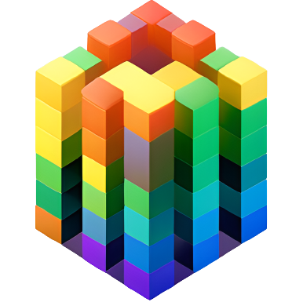

<p align="center">

</p>
<h1 align="center">
Spectral Nonogram
</h1>
<p align="center">
Colorful puzzle game: Match clues, fill grid, solve RGB values.
<p>


## About

<!-- <Main description>   -->

Spectral Nonogram is a simplified colorful puzzle game where players need to fill a grid based on provided clues, ensuring that the color sum of each row and column matches the given RGB values. It's an engaging and challenging game that exercises your logic and problem-solving skills.

## Getting Started

To get started with Spectral Nonogram, follow these steps:

1. Clone the repository to your local machine.
2. Install the required dependencies by running the following command:

   ```
   pip install -r requirements.txt
   ```

3. Launch the application by executing the following command:

   ```
   python app/main.py
   ```

4. Open a web browser and visit `http://localhost:8050` to access the game.

## Dependencies

The project relies on the following dependencies:

- dash==2.11.1
- dash-bootstrap-components==1.4.1
- pandas==2.0.3
- Werkzeug==2.2.0
- MarkupSafe==2.1.2
- Flask-Session==0.5.0

To install these dependencies, you can use the provided `requirements.txt` file. Run the following command:

```shell
pip install -r requirements.txt
```

## Docker Support

Alternatively, you can run the application using Docker. The repository includes a `Dockerfile` for easy containerization. Follow these steps to run the application using Docker:

1. Build the Docker image by executing the following command:

   ```
   docker build -t spectral-nonogram .
   ```

2. Run the container using the built image:

   ```
   docker run -p 8050:8050 spectral-nonogram
   ```

3. Access the application by visiting `http://localhost:8050` in your web browser.

## Project Structure

The project structure is organized as follows:

- `app/`: Contains the main application files.
  - `__init__.py`: Initializes the Dash application.
  - `main.py`: Entry point for the application. Sets up the layout and registers callbacks.
  - `layouts.py`: Defines the layout structure for the game board and other components.
  - `callbacks.py`: Contains the callback functions that handle user interactions.
  - `utils.py`: Utility functions used in the application.
  - `assets/`: Contains the CSS file (`style.css`) used for custom styling.

## Contributing

Contributions to the Spectral Nonogram project are always welcome! If you encounter any issues or have ideas for improvements, please feel free to open an issue or submit a pull request.

## License

This project is licensed under the [MIT License](LICENSE). Feel free to use, modify, and distribute the code for personal and commercial purposes.
